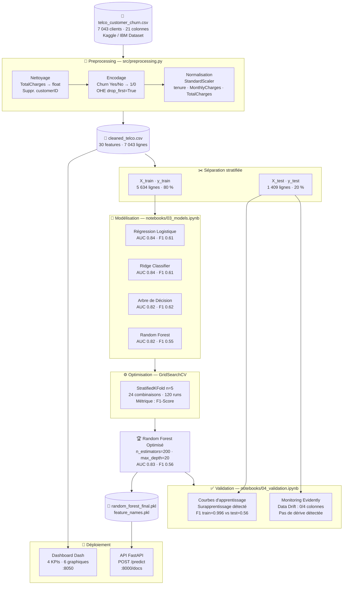
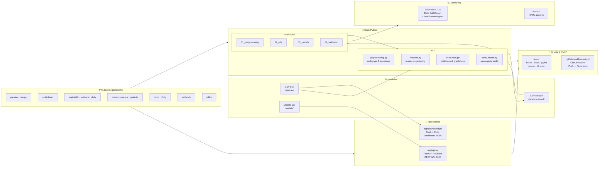
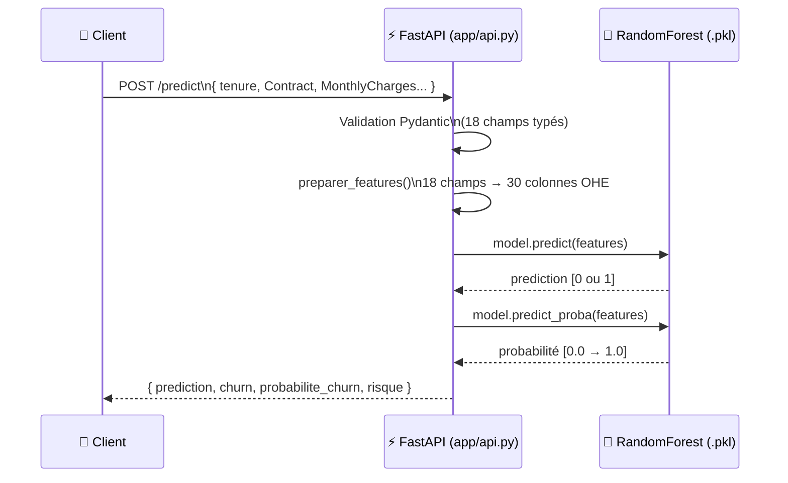

# Architecture du Projet — Prédiction du Churn Client

---

## 1. Pipeline de données (Data Flow)



---

## 2. Architecture technique (Stack)



---

## 3. Architecture de l'API (FastAPI)



---

## 4. Structure des dossiers

```
Projet_3/
│
├── .github/workflows/ci.yml     ← CI/CD GitHub Actions
│
├── app/
│   ├── api.py                   ← API REST (FastAPI + Uvicorn)
│   └── dashboard.py             ← Dashboard interactif (Dash + Plotly)
│
├── data/
│   ├── raw/                     ← Dataset brut Kaggle (non versionné)
│   └── processed/               ← CSV nettoyé (versionné)
│
├── docs/
│   ├── rapport.md               ← Rapport final & justification des choix
│   ├── competences.md           ← Mapping compétences brief ↔ réalisations
│   └── architecture.md          ← Ce fichier
│
├── models/
│   ├── random_forest_final.pkl  ← Modèle entraîné (non versionné)
│   └── feature_names.pkl        ← Noms des 30 features (non versionné)
│
├── notebooks/
│   ├── 01_preprocessing.ipynb   ← Nettoyage & préparation
│   ├── 02_eda.ipynb             ← Analyse exploratoire
│   ├── 03_models.ipynb          ← Entraînement & comparaison
│   └── 04_validation.ipynb      ← Validation & monitoring
│
├── reports/
│   ├── data_drift_report.html   ← Rapport Evidently (dérive)
│   └── model_performance_report.html
│
├── src/
│   ├── preprocessing.py         ← Fonctions de nettoyage
│   ├── features.py              ← Feature engineering
│   ├── evaluation.py            ← Métriques & visualisations
│   └── save_model.py            ← Script de sauvegarde
│
├── tests/
│   ├── test_code_quality.py     ← flake8 + black + pylint
│   ├── test_preprocessing.py    ← Tests unitaires preprocessing
│   ├── test_model.py            ← Tests modèle sauvegardé
│   └── test_api.py              ← Tests routes FastAPI
│
├── requirements.txt
└── README.md
```
